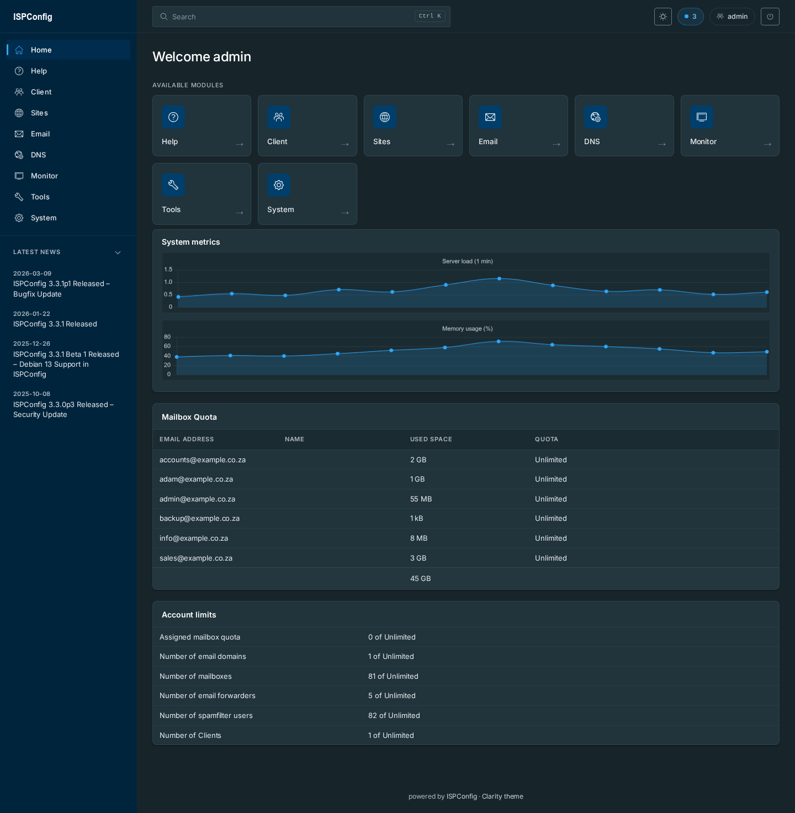
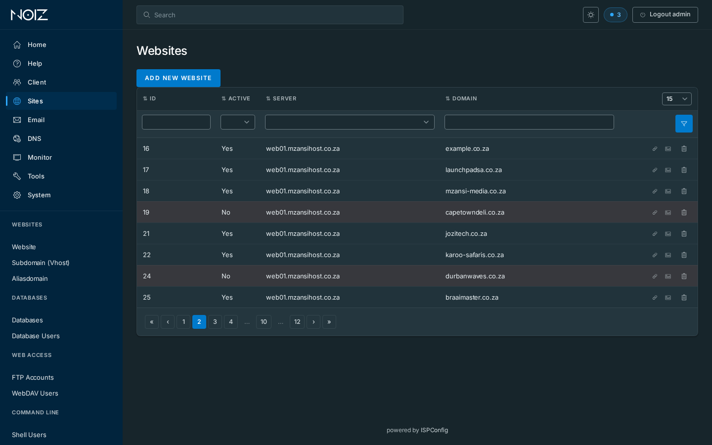
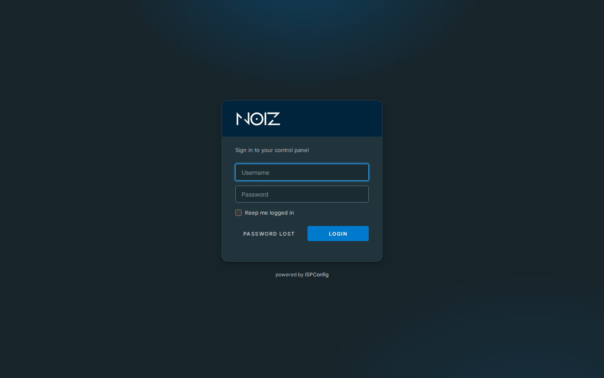
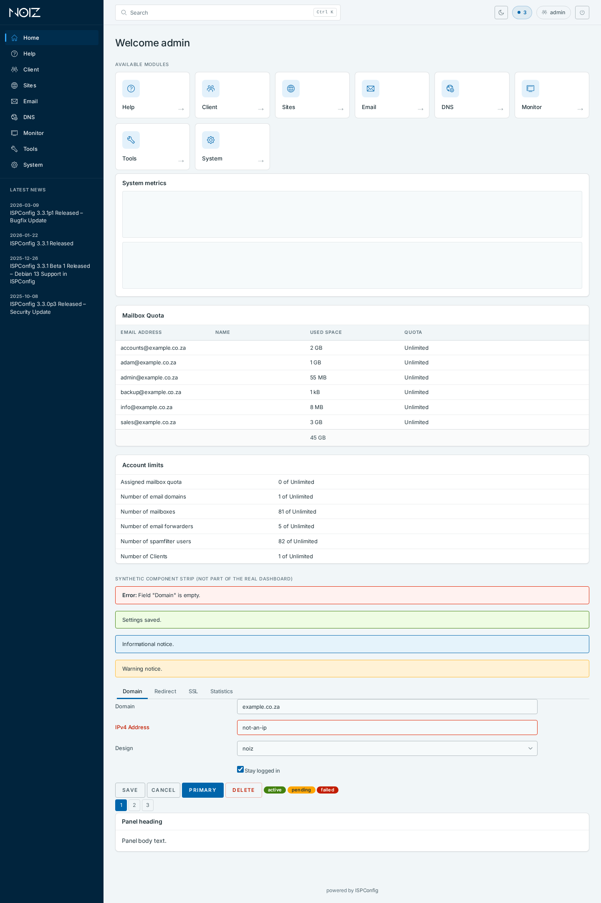
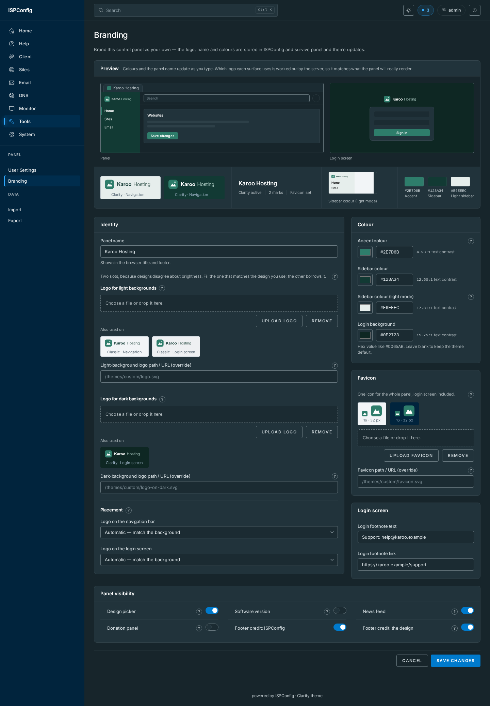

# ISPConfig Theme Customizer

An extension for the [ISPConfig](https://www.ispconfig.org/) control panel that
makes the panel brandable. It replaces the panel's front-end with a design, and
adds an admin-only **Branding** page inside the panel where you set your logo,
panel name, accent colour and login details instead of editing files by hand.

Two designs ship with the extension: **clarity**, a ground-up dark/light
interface built on VMware Clarity design tokens (navy navigation rail,
card-based content, Clarity icons, a theme switcher, a redesigned login screen),
and **classic**, the stock ISPConfig look made brandable. `--design` picks;
[the interface](#the-interface) explains the difference. Every option on the
Branding page works on both.

A design reads its colours, logo and panel name from exactly the keys that page
writes. That shared contract is why this is one product, with one version number
and one tag.

Everything it installs is additive: a theme directory under
`interface/web/themes/`, and an ISPConfig **module** — the mechanism that puts a
page in the panel's top navigation — under `interface/web/customizer/`. **No
core file is ever modified and no database schema is added.**



| | |
|---|---|
|  |  |
|  |  |

Those are the clarity design. More in [`mockup/shots/`](mockup/shots/) (mobile,
forms, components, and `default-desktop.png` for a stock-panel comparison — the
shape classic keeps) and [`docs/screenshots/`](docs/screenshots/).

## What you get

### The interface

Two designs, selected with `--design` (see [Install](#install)). They are
alternatives, not layers: pick one, or install both and let each user choose in
the Design picker. Both read the same brand tokens, so the Branding page drives
either one.

#### clarity — the default

- Vertical brand rail, topbar, card surfaces, restyled tables, forms, tabs and
  modals — applied by CSS to the stock markup, not by rewriting pages.
- **Dark and light**, with an in-panel switcher; the choice is stored in
  `localStorage`, so it is per browser.
- Clarity icon shapes replacing the legacy `ispconfig` icon font, the Bootstrap
  glyphicons and the FontAwesome 4 glyphs the panel still emits — inlined as CSS
  masks, so the icons themselves add no font of their own and no extra request.
  The stock icon fonts still load as vendor dependencies from `themes/default`;
  no covered glyph renders from them.
- Self-hosted **Inter**. No external font, script or CDN request is added.
- Six overridden templates and nothing else: three shell templates
  (`main.tpl.htm`, `main_login.tpl.htm`, `topnav.tpl.htm`) and three dashboard
  dashlet templates (`dashboard.htm`, `modules.htm`, `metrics.htm`). Every other
  page renders from the stock `default` theme and is styled by CSS alone. All
  six are pinned, with the JS and template-variable contracts each one preserves,
  in [`themes/clarity/BUILT-AGAINST.txt`](themes/clarity/BUILT-AGAINST.txt) —
  that file is what you re-check after a panel upgrade.
- Vendor CSS/JS still loads from `themes/default`, so that directory must remain
  present. It always is.

#### classic — the stock look, made brandable

- The panel you already know: stock layout, stock stylesheets, stock everything,
  with your logo, panel name, accent colour, navigation band and login
  background applied on top of it. Install with `--design=classic`.
- No CSS, fonts or images of its own. Every asset is served from
  `themes/default/assets/`; it ships `brand.php`, `title.php` and a README.
- Its **two** shell templates (`main.tpl.htm`, `main_login.tpl.htm`) are
  **generated at install time** from the target panel's own
  `themes/default/templates/` and are deliberately not in the repository —
  which is why browsing GitHub shows no `templates/` directory under
  `themes/classic/`. `install.sh` makes two mechanical changes (pin asset paths
  to `themes/default/assets/`, link `brand.php` and `title.php` before
  `</head>`), splits the stock footer credit into two addressable spans, and
  aborts rather than deploy a template it cannot account for.
- That is what makes classic stock-by-construction and self-healing: the
  installer run you already have to do after a panel upgrade regenerates the
  shell from the new stock markup, so there is nothing to diff by hand. Full
  reasoning in [`themes/classic/README.md`](themes/classic/README.md).

### The Branding page

One admin-only page, labelled **Branding** in the top navigation (not
"Customizer" — that is only the directory name). It writes core's own settings — the existing
`sys_ini` row, plus (for the donation-dashlet switch) the `sys_config` row
ISPConfig's own Hide button already uses; it creates no tables and no columns. (The
module-list grant lives in `bin/assign_module.php`, run by the installer, not in
the page itself.)
The UI ships in seven locales: English, German, French, Spanish, Italian, Dutch
and Portuguese.

**Some of it works with no design installed at all** — these values are read by
ISPConfig core itself, which is why `install.sh --module` is a real option on a
panel that is staying on the stock `default` theme:

| Setting | Where core reads it |
|---|---|
| `custom_logo` (the **light-background** logo uploader) | login page and panel header — both light surfaces, which is why that variant lives in core's own column |
| `company_name` | browser title prefix |
| `custom_login_text` / `custom_login_link` | the extra line on the login screen |
| `dashboard_atom_url_admin` / `_reseller` / `_client` | the per-role dashboard news feed, which the page's news toggle drives |
| `hide_donation_dashlet` (`sys_config`) | the donation appeal on the admin dashboard — core checks it at `dashboard.php:222-228` before building the dashlet, and its own Hide button writes the same row |

The uploader exists because the stock panel's own logo upload is currently
non-functional. The field it writes is ISPConfig's, not a new one.

If you want the stock look *and* the rest of this page to do something, install
`--design=classic` rather than `--module` alone: same look, every option live.

**Needs a brand-aware design** — clarity or classic, or anything else that
adopts the [contract below](#the-brand-token-contract). Nothing in core reads
these:

| Setting | Effect |
|---|---|
| `accent_hex` | re-hues the blue ramp and accents |
| `rail_hex` | the main navigation band — clarity's navy brand rail, classic's navbar |
| `login_bg` | login-screen background base |
| `logo_url` | **light-background** logo by reference (root-relative path or `https` URL); wins over the uploaded `custom_logo` |
| `logo_on_dark` | **dark-background** logo, uploaded (a data URI). Core has no second logo column and this extension adds none, so this one rides in the config blob — see the note below |
| `logo_url_on_dark` | **dark-background** logo by reference; wins over `logo_on_dark`, and keeps the image out of the config blob entirely |
| `logo_variant_nav` | which of the two marks the **navigation bar** uses: unset = automatic (the default), or pin it to the light-background or the dark-background one |
| `logo_variant_login` | the same choice for the **login screen**, set independently |
| `favicon` | the **tab icon**, uploaded (a data URI: SVG, PNG or ICO, under 15 KB) |
| `favicon_url` | the tab icon by reference; wins over `favicon`, and keeps the image out of the config blob |
| `show_version` | hides the version surfaces on the Help page — read [Version disclosure](#version-disclosure) before relying on it |
| `show_ispconfig_credit`, `show_theme_credit` | the two footer courtesy lines |

**Two logos, named after the background they sit on.** One panel runs designs
whose headers disagree about brightness — clarity's rail is navy and wants a
white mark, classic's header is stock's `#f2f5f7` and wants a dark one — so a
single logo cannot serve both. Each surface asks for the variant matching the
background it sits on and **falls back to the other one when that variant is
unset**, which is what makes this non-breaking: a panel with only the historical
`custom_logo` renders exactly as it always did. Within a variant, a reference
beats an upload.

**Which of the two a surface uses is worked out for you — and you can overrule
it.** Left on **Automatic**, which is the default and what an unset value means,
each surface picks the mark that will read against its own background: the
navigation bar looks at `rail_hex`, the login screen at `login_bg`, and where
you have set neither, the design's own colours decide — on clarity that means
the login mark follows the viewer's light or dark mode, exactly as it does
today. The reason the override
exists is that those two settings can falsify the design's assumption — clarity
puts the logo on a navy rail and so wants the white mark, but set `rail_hex` to
white and the white mark is what you would get, on a white rail. Set
`logo_variant_nav` or `logo_variant_login` and that surface is pinned to the
mark you name, independently of the other.

On classic, neither colour reaches a logo, so neither is read: `rail_hex`
recolours the navigation band *below* the header strip the logo sits in, and
`login_bg` paints the page *behind* the login card rather than the card's own
light header the mark sits inside. Automatic therefore stays on the
light-background mark on both of classic's surfaces, and the explicit setting is
how you change it.

**With a single logo this setting does nothing, which is the intent.** It only
chooses between two marks you have both stored; the fallback above is unchanged,
so naming a variant you have not filled still renders the one you did rather
than nothing.

The cost of `logo_on_dark`, stated plainly: it is stored in `sys_ini.config`
rather than a column, so it is re-read whenever the panel loads a global setting
and it is journalled into `sys_datalog` by the next save of the Branding page.
The column is `longtext` so nothing truncates, and the 45 KB upload cap bounds
it — but if that trade does not suit your panel, use `logo_url_on_dark`, which
stores a path. The uploaded `favicon` shares that store and that trade, at a
much smaller 15 KB cap; `favicon_url` is its escape hatch.

**One favicon, served by an endpoint.** Each design exposes
`themes/<design>/favicon.php`, and its shell links that as the single
`<link rel='icon'>`. It answers with your icon and falls back to the design's
shipped one when nothing is set, so an unbranded panel looks exactly as it did.
It is an endpoint rather than a CSS rule because a favicon is a `<link>`, not a
style — and a JavaScript swap would flicker and would do nothing with scripting
off, on a pre-authentication page. Unlike the logo there is no light/dark pair:
a browser paints the same icon whatever the design's header looks like. Check
the 16px preview on the Branding page before you settle on one; a mark that is
unreadable at that size is the whole failure mode, and a tab is the smallest
place your brand ever appears.

Every row in both tables works on **both** designs. The two footer toggles are
not clarity-only: `install.sh` splits stock's single footer line while it
generates classic's shell, so each credit is individually hideable there too.

Attribution defaults to **on**, on both designs, and neither toggle touches a
licence notice. The admin update notice is left exactly as ISPConfig ships it.

The donation dashlet has a switch of its own, also defaulting to **on**. It is
admin-only in core, so no reseller or client ever saw it — this is about your own
dashboard, not what your customers see. Switching it off writes the same
`sys_config` row ISPConfig's own **Hide** button writes, so the panel never
builds the block rather than hiding it after the fact; the difference is that it
does not expire after a year. clarity also restyles the dashlet, keeping the
appeal, the donation link and the Hide button exactly where core puts them.

## Install

Installation is `git clone` plus `./install.sh`. ISPConfig's own *System →
Extension Installer* screen lists only what is in
[repo.ispconfig.com](https://repo.ispconfig.com/api/v1/list/), ISPConfig UG's
curated repository, so this extension is **not** available there — there is no
one-click path today.

Clone somewhere the web server can read — **not `/root`**, which is mode 700 and
serves nothing through a symlink:

```bash
cd /opt
git clone https://github.com/wadejbeckett/ispconfig-theme-customizer.git
cd ispconfig-theme-customizer
sudo ./install.sh
```

```
./install.sh [--theme|--module|--all] [--design=<name>] [--copy]
             [--no-assign] [ISPCONFIG_ROOT]
```

- With no component flag, **both** halves are installed. `--theme` installs only
  the design; `--module` installs only the Branding page.
- `--design=<name>` takes `clarity`, `classic` or `all`, and is repeatable
  (`--design=clarity --design=classic` is the same as `--design=all`). It is a
  **separate axis** from `--theme`/`--module`/`--all`: those pick which halves,
  this picks which design the theme half means. Default is `clarity` — a second
  design never appears in the panel's Design picker unless you ask for it — so
  bare `./install.sh` means exactly what it always did. Naming a design
  alongside `--module` alone installs no design, and the installer says so.
- `--copy` copies real files instead of symlinking. Symlinks mean the panel
  reads from your clone, so the clone and every parent directory must stay
  traversable by the web server; with `--copy` the clone can live anywhere and
  need not stay on the server at all. The installer warns if the path is not
  traversable.
- `--no-assign` skips assigning the module to admin users; do it by hand in
  *System → CP Users → edit the admin user → Modules*.
- `ISPCONFIG_ROOT` defaults to `/usr/local/ispconfig`.

The installer also stamps the two version-gate files ISPConfig requires
(`ispconfig_version` and `ISPC_VERSION`) into every design directory it
installs, and prints the next steps.

Multiserver: install only on the server that serves the ISPConfig web interface.
Slaves need nothing.

**Then pick the design.** Per user: *Tools → User Settings → Design →
`clarity` (or `classic`) → Save*. Core updates the session theme on save and
force-reloads the page, so the change applies immediately — the code does not
require a login round trip. In practice, if the frame still looks stock, log out
and back in, then hard-refresh (`Ctrl+Shift+R`) so the browser drops the old
CSS.

**Manual step — login screen and system-wide default.** `install.sh` never
edits ISPConfig configuration, by design. To set the default yourself, add

```php
$conf['theme'] = 'clarity';   // or 'classic'
```

to **both** `interface/lib/config.inc.php` **and** `server/lib/config.inc.php`
(each already has the line, set to `'default'`). The interface one controls the
login page and the default for new users. The server one is what makes it
persist: ISPConfig updates regenerate both files and carry the theme value
forward from the **server** config, so setting only the interface one means the
login screen quietly reverts at the next panel update.

**The Branding page** appears in the top navigation after the next page load or
re-login.

## After any ISPConfig upgrade

Re-run the installer after **every** panel upgrade, including patch releases
(`3.3.1p1` → `3.3.1p2`):

```bash
cd /opt/ispconfig-theme-customizer
git fetch --tags && git checkout <tag>
sudo ./install.sh                     # add the same --design flags you used
```

This applies to both designs and is not just for major versions. Core compares
the stamped `ispconfig_version` against `ISPC_APP_VERSION` as an exact string;
on any mismatch it resets affected users to the default theme at login and the
Design picker stops offering the design. That value changes on every release.

If you installed with `--copy`, re-run **with `--copy` again** — re-running
without it converts the install into a symlink pointing at your clone. Likewise
pass `--design=` again for anything other than clarity: the default is clarity,
so a bare re-run leaves a `classic` install unstamped, and the installer warns
when it finds a design directory it did not stamp.

After a **major** upgrade (3.3 -> 3.4), not every patch release, also diff
**clarity**'s seven overridden templates against the stock
ones for your new version before trusting the upgrade. Compare against your own
panel's `interface/web/themes/default/templates/` and
`interface/web/dashboard/**/templates/`, or against the ISPConfig source for
that version; `BUILT-AGAINST.txt` lists what each override must preserve.
**classic** needs no such diff — the same `install.sh` run regenerates its two
shell templates from the new stock ones. Full procedure in
[UPGRADING.md](UPGRADING.md).

## Compatibility

- **ISPConfig 3.3** — developed and verified against **3.3.1p1**. Clarity's
  template overrides are pinned to that version's stock markup; classic's are
  generated from whatever stock markup your panel has, and the generator aborts
  if it does not recognise it.
- **ISPConfig 3.2 is not verified.** It has not been tested, and nothing here
  claims it works. Treat it as unknown.
- Root shell access to the panel server, and the stock `default` theme still
  present (clarity loads its vendor CSS/JS from there; classic loads everything
  from there).
- PHP CLI, for the module-assignment and cleanup helpers. Without it the
  installer says so and prints the manual equivalent.

## Version disclosure

Read this before deploying on a public panel.

ISPConfig's theme gate requires the file `themes/<theme>/ispconfig_version`
inside the panel's **web root**, under that exact name — so the web server
serves it as an ordinary static file:

```bash
for d in clarity classic; do
  curl -k https://panel.example.com:8080/themes/$d/ispconfig_version
done
# a design you did not install returns 404 either way
# 3.3.1p1
```

It applies to every design installed — `themes/classic/ispconfig_version` is
served the same way. No session, no credentials. Anyone who can reach your login
page learns the exact version **and patch level**. This is not stock behaviour:
ISPConfig's own `default` theme ships no version file and that URL returns 404 —
tested. The exposure arrives with any third-party theme, this one included. It
also undercuts the `show_version` toggle on the Branding page, which hides the
version on the Help page while the same string stays readable one URL away.

The fix belongs at the web-server layer, and ISPConfig already denies files this
way in its own panel vhost. Ready-made nginx and Apache snippets, with the full
explanation, are in [`contrib/webserver/`](contrib/webserver/README.md); the
rules match any theme directory, so one copy covers both designs.

## Uninstall

```
./uninstall.sh [--theme|--module|--all] [--design=<name>] [--reset-users]
               [--purge-branding] [--keep-assignment] [ISPCONFIG_ROOT]
```

Same component flags as the installer: with none, **both** halves are removed.
`--design` takes the same values (`clarity`, `classic`, `all`) and is likewise
repeatable — but here it defaults to **all designs**, not to clarity. Removal
has to clear whatever might be on the panel; a narrow default would leave a
stray design behind. Removing one that was never installed just prints that
there was nothing to do.

What `uninstall.sh` actually does, stated plainly, because the defaults are
deliberately conservative:

- **It does not restore stock on its own.** Removing a design directory leaves
  `sys_user.app_theme` still pointing at it; **`--reset-users`** is what clears
  that column, for exactly the designs being removed. That matters: core falls
  back to the default theme at session level but never heals the stored value,
  so without it affected users get a "theme not compatible" banner at every
  login. Skip it only if you are reinstalling.
- **Your branding survives by default.** The `interface/web/customizer/`
  directory goes and `customizer` is stripped from users' module lists
  (resetting any startmodule that pointed at it), but the stored values are left
  alone — the stock fields keep working and stay editable under *System →
  Interface Config*, and the `[branding]` values sit inert, ready for any
  brand-aware design. **`--purge-branding`** wipes them;
  **`--keep-assignment`** leaves `customizer` in users' module lists.
- **`$conf['theme']` is always yours to revert.** Nothing here edits ISPConfig
  configuration. If you set it to `'clarity'` or `'classic'`, set it back to
  `'default'` in both files. `uninstall.sh` checks and warns you *before* it
  removes anything, because a panel still configured for a theme directory that
  no longer exists serves a login page with every stylesheet and script 404ing,
  silently.

## The brand-token contract

The Branding page writes, and the design reads, a small set of keys in the
global `sys_ini` row (`sysini_id = 1`) — the `[branding]` and `[misc]` values
listed in the two tables above. That is the entire coupling: no shared code, no
API.

Neither design is the product's identity — they are two implementations of the
same contract, which is the point. Anything that reads the same keys inherits
the whole Branding page for free; CI fails the build if a key the Branding page
writes is not read back, so a further design can drop in against a contract that
is enforced rather than assumed. The two implementations are
[`themes/clarity/brand.php`](themes/clarity/brand.php) and
[`themes/classic/brand.php`](themes/classic/brand.php) — read-only, pre-auth
stylesheet endpoints that query one row, emit CSS, and are a no-op when nothing
is set. Clarity emits custom properties into its own token layer; classic
overrides stock's selectors, taking your hue and stock's own lightness for each
role. The audit of every place ISPConfig identifies itself, and which of those
can be overridden inside the extension envelope, is in
[docs/WHITELABEL.md](docs/WHITELABEL.md).

On clarity you can also brand it with file swaps and no stored values at all:
replace `themes/clarity/assets/images/wordmark-white.svg` (light artwork — it
sits on the navy rail, the mobile header and the login card; any aspect ratio
works) and drop your own icons into `themes/clarity/assets/favicon/`. A logo set
on the Branding page, or in ISPConfig's native field, overrides the wordmark;
a favicon set there overrides the tab icon, and the files in that directory
remain the fallback plus the source of the platform icons the tab does not use
(home-screen icon, pinned-tab mask, Windows tile).

### One version number

Until v3.0.0 this shipped as two repositories with independent version numbers,
and nothing enforced that the two sides of the contract matched: `brand.php`
read exactly the keys `customizer_edit.php` wrote, but v1.0.12 of one against
v2.1.0 of the other meant the accent colour silently did not apply, with no
error anywhere. One contract, so now: one repository, one version number, one
tag.

**v3.0.0** is the first combined release. The number sits above both old lines
(v2.2.4 and v1.0.13) and is a major bump because the repository layout changed.
There are no submodules; a plain `git clone` is all you need.

## Repo layout

| Path | What |
|---|---|
| `themes/clarity/` | The default design: 6 templates, stylesheets, self-hosted fonts, brand assets. |
| `themes/clarity/brand.php` | Brand-token reader — read-only pre-auth stylesheet endpoint; a no-op when nothing is set. |
| `themes/clarity/favicon.php` | Tab-icon endpoint — serves the operator's favicon, falls back to the design's shipped one. Pre-auth, and it never 404s. |
| `themes/clarity/BUILT-AGAINST.txt` | What is overridden, against which stock version, and the contracts each override preserves. |
| `themes/classic/` | The stock look, made brandable. `brand.php`, `title.php`, `favicon.php`, a README — no assets, and no `templates/`. |
| `themes/classic/brand.php` | Same reader against stock's selectors; also serves the login scene (`?scene=login`). |
| `themes/classic/favicon.php` | Same icon endpoint; with nothing set it streams stock's own icon from `themes/default/assets/`. |
| `themes/classic/templates/` | **Generated by `install.sh`** from the target panel's own stock templates. Not in the repository, not to be hand-edited. |
| `interface/web/customizer/` | The Branding page — an ISPConfig module (directory name `customizer`; nav label "Branding"). |
| `bin/` | PHP helpers the scripts call: module assign/unassign, theme reset, branding purge. |
| `install.sh`, `uninstall.sh` | One of each; `--theme` / `--module` / `--all` select which halves, `--design` selects which design. |
| `contrib/webserver/` | nginx and Apache snippets for the version-disclosure mitigation. |
| `DESIGN.md` | Clarity's design language — tokens, surfaces, component rules. Does not apply to classic, which has none by design. |
| `UPGRADING.md` | Version stamp and override contracts across panel upgrades. |
| `docs/WHITELABEL.md` | Verified audit of ISPConfig's self-identification surfaces. |
| `mockup/` | Offline dev harness: renders the real templates with sample content and screenshots them (`python3 build.py --shoot`; needs Playwright and a local ISPConfig source checkout for the stock vendor assets). Not needed to install. |

## Contributing

Bug reports, fixes and ideas are welcome — see [CONTRIBUTING.md](CONTRIBUTING.md)
for how it is put together, the ground rules that keep it upgrade-safe, and how
to test a change. The issue templates ask for exactly what makes an interface or
branding bug diagnosable. Security reports:
[SECURITY.md](SECURITY.md).

## Support this project

Free and MIT-licensed. If it saves you time, donations are taken in Monero:

```text
44BtMn9izxH8mK2yFbSdY6Di7TNobkLbnHdZ6gZQjukCME5vsNhtPRtH4TcVkDHKHLhSpAJbsjv8gCdYuSZVMpXgMkUC1hV
```

Code is just as welcome as coin.

### Support ISPConfig itself

This project only exists because ISPConfig does, and it is built to sit on top
of ISPConfig rather than replace any part of it. The project takes no direct
donations; the ways its developers ask to be supported are:

- Buy the [ISPConfig manual](https://www.ispconfig.org/documentation/user-manual/)
  (€5) or a [HowtoForge subscription](https://www.howtoforge.com/download-the-ispconfig-3-manual)
  that includes it — the project's own README names this as the way to fund
  development.
- Need paid help? [ISPConfig Business Support](https://www.ispconfig.org/get-support/)
  is run by the core team's official partner.
- Their commercial tools fund the free panel:
  [ISPProtect](https://www.ispprotect.com/) and the
  [Migration Tool](https://www.ispconfig.org/add-ons/ispconfig-migration-tool/).
- Contribute upstream: code and bug reports at
  [git.ispconfig.org](https://git.ispconfig.org/ispconfig/ispconfig3), help
  other users at the [HowtoForge forum](https://forum.howtoforge.com/).

## Licence and attribution

- This project: [MIT](LICENSE).
- **VMware Clarity (`@cds/core`, MIT).** Surface and status values are derived
  from Clarity's dark theme tokens, and 29 Clarity **icon shapes are bundled
  verbatim** as data-URI SVG masks in
  `themes/clarity/assets/stylesheets/clarity/icons.css`. That is redistribution
  of a substantial portion of the upstream work, so the MIT copyright and
  permission notice ships in that file's header, attached to the artwork itself.
  Keep the header with the shapes if you vendor the theme.
- **Inter** — [SIL OFL 1.1](themes/clarity/assets/fonts/inter/LICENSE.txt),
  self-hosted.
- Frame anatomy informed by DirectAdmin Evolution (reference only; nothing
  copied).
- ISPConfig is BSD-licensed. This project ships no ISPConfig code and modifies
  none.

### Notices

- Not affiliated with, or endorsed by, **VMware**. Built using the open-source
  Clarity design system (`@cds/core`, MIT).
- Not affiliated with, or endorsed by, the **ISPConfig project**. ISPConfig is a
  trademark of its respective owner; this is an independent, third-party
  front-end that builds on ISPConfig and competes with nothing in it.

---

Maintained by [Wade Beckett](https://github.com/wadejbeckett) as an independent,
open-source project — contributions welcome from anyone.
